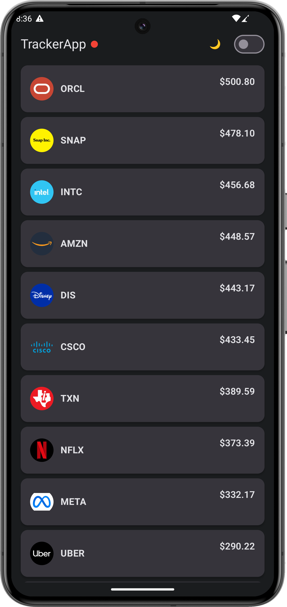
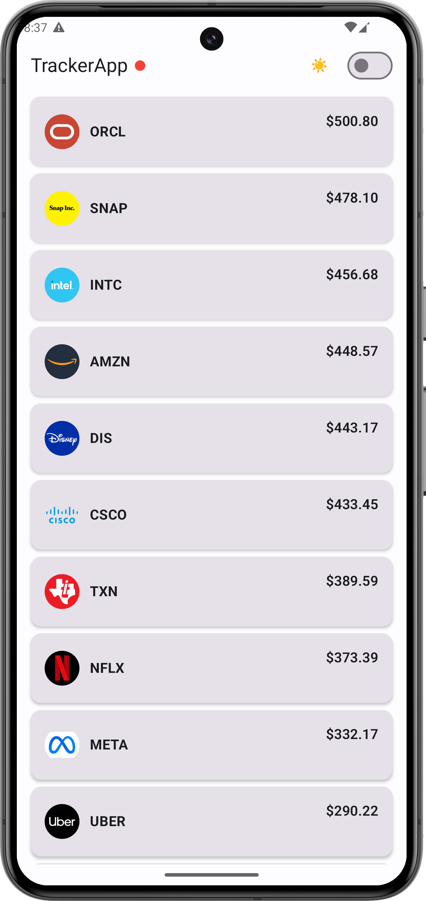
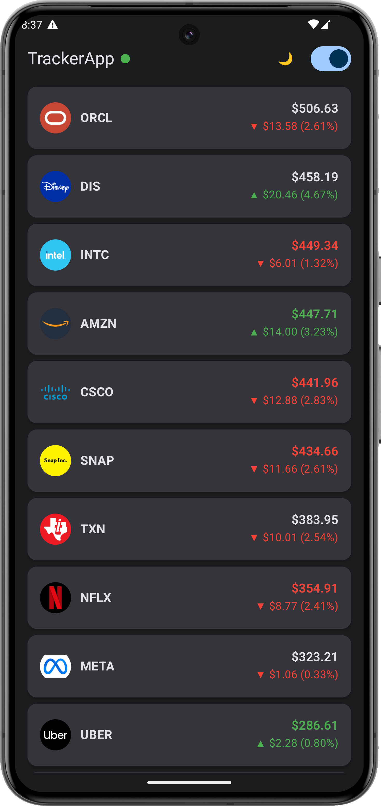

# TrackerApp - Real-Time Stock Price Tracker

A modern Android application built with Jetpack Compose that displays real-time price updates for 25 stock symbols using WebSocket communication. The app connects to a WebSocket echo server, sends mock price updates every 2 seconds, and displays live data in a clean, scrollable interface.

## 📸 Preview

<table>
  <tr>
    <td></td>
    <td></td>
    <td></td>
  </tr>
  <tr>
    <td align="center"><em>Dark theme (Disconnected)</em></td>
    <td align="center"><em>Light theme</em></td>
    <td align="center"><em>Dark theme with live updates</em></td>
  </tr>
</table>

**Key UI Features Shown:**
- 🎨 **Dual Theme Support**: Seamless light/dark mode with moon/sun toggle
- 🔴🟢 **Connection Status**: Visual indicator (red = disconnected, green = connected)
- 📊 **Real-time Updates**: Price changes with ▲/▼ indicators and percentage changes
- 🎯 **Clean Design**: Material 3 with rounded cards and company logos
- 📱 **Sorted List**: Automatically sorted by price (highest to lowest)

## 📱 Features

- **Real-time Price Tracking**: Monitor 25 major stock symbols (AAPL, GOOG, TSLA, NVDA, etc.)
- **Live WebSocket Connection**: Connects to `wss://ws.postman-echo.com/raw` for real-time data exchange
- **Visual Price Indicators**: Green ↑ for price increases, Red ↓ for decreases
- **Price Flash Animation**: Visual feedback with 1-second color flash on price changes
- **Dynamic Sorting**: Automatically sorts stocks by price (highest to top)
- **Connection Management**: Start/Stop button with connection status indicator
- **Theme Support**: Light and Dark theme with system default option
- **Clean Architecture**: Multi-module structure with clear separation of concerns
- **Comprehensive Testing**: Unit tests for business logic and UI tests for all Compose components

### ✨ Bonus Requirements (All Implemented)

All optional bonus requirements from the challenge have been implemented:
- ✅ **Price Flash Animation**: Prices flash green for 1 second on increase, red on decrease
- ✅ **Comprehensive Testing**: Full test coverage including Compose UI tests for all components and screens
- ✅ **Theme Support**: Complete light/dark theme implementation with system default option

## 🏗️ Architecture

This project follows **Clean Architecture** with **MVVM** (Model-View-ViewModel) pattern in a **multi-module** structure:

```
┌─────────────────────────────────────────────┐
│  App (Presentation)                         │
│  • Jetpack Compose UI                       │
│  • ViewModels + StateFlow                   │
│  • Immutable UI State                       │
└──────────────┬──────────────────────────────┘
               │
┌──────────────▼──────────────────────────────┐
│  Domain (Business Logic)                    │
│  • Use Cases (Single Responsibility)        │
│  • Repository Interfaces                    │
│  • Domain Models                            │
└──────────────┬──────────────────────────────┘
               │
┌──────────────▼──────────────────────────────┐
│  Data (Data Layer)                          │
│  • Repository Implementations               │
│  • WebSocket Manager (OkHttp)               │
│  • DataStore (Theme Persistence)            │
└─────────────────────────────────────────────┘
```

<details>
<summary><b>📋 Detailed Architecture Breakdown</b></summary>

### Layer Responsibilities

**App Module** (Presentation Layer)
- `TrackerScreen` & `StockListItem`: Compose UI components
- `TrackerViewModel` & `MainViewModel`: State management with StateFlow
- Observes domain use cases and exposes immutable UI state

**Domain Module** (Pure Kotlin)
- **Use Cases**: `ObserveStockPricesUseCase`, `StartConnectionUseCase`, `StopConnectionUseCase`, etc.
- **Repository Interfaces**: Define contracts for data operations
- **Models**: Domain entities (Stock, ConnectionState)
- Completely independent of Android framework

**Data Module**
- **Repositories**: `StockRepositoryImpl`, `ConnectionRepositoryImpl`, `ThemeRepositoryImpl`
- **WebSocketManager**: Handles real-time connection with OkHttp
- **StockPriceCoordinator**: Generates mock price updates every 2 seconds
- **StockDataSource**: 25 stock symbols with metadata

### MVVM Data Flow

```
View (Compose) ──► ViewModel ──► Use Case ──► Repository Interface
                      │                               │
                 StateFlow ◄──────────────────────────┘
                                                      │
                                          Repository Impl ──► WebSocket/DataStore
```

**Key Benefits**: Separation of concerns • Testability • Scalability • Maintainability

**Dependency Injection**: Hilt with `@HiltViewModel` and `@Singleton` scopes  
**State Management**: StateFlow for reactive UI • Immutable state • Unidirectional data flow

</details>

## 🚀 How to Run the Project

### Prerequisites

- **Android Studio**: Ladybug | 2024.2.1 or newer
- **JDK**: Java 17 (included in Android Studio)
- **Minimum SDK**: API 24 (Android 7.0)
- **Target SDK**: API 36 (Android 15)

### Steps to Build and Run

1. **Clone the repository**:
   ```bash
   git clone <repository-url>
   cd TrackerApp
   ```

2. **Open in Android Studio**:
   - Launch Android Studio
   - Select "Open an existing project"
   - Navigate to the `TrackerApp` directory and select it

3. **Sync Gradle**:
   - Android Studio should automatically trigger a Gradle sync
   - If not, click "File" → "Sync Project with Gradle Files"
   - Wait for dependencies to download (first sync may take a few minutes)

4. **Run on Emulator or Device**:
   - **Emulator**: Create an AVD (Android Virtual Device) via "Device Manager"
     - Recommended: Pixel 5 or newer with API 34+
   - **Physical Device**: Enable USB debugging in Developer Options
   - Click the green "Run" button (▶️) or press `Shift + F10`

5. **Verify the App**:
   - The app should launch with 25 stock symbols displayed
   - Tap the "Start" button in the top bar to begin real-time updates
   - Observe prices updating every 2 seconds with animations
   - Check the connection indicator (●) showing Connected/Disconnected status

### Alternative: Build from Command Line

```bash
# Build debug APK
./gradlew assembleDebug

# Install on connected device
./gradlew installDebug

# Run all tests
./gradlew test

# Run connected tests (requires device/emulator)
./gradlew connectedAndroidTest
```

### Troubleshooting

- **Build fails**: Ensure you have Java 17 configured in Android Studio settings
- **Dependencies not downloading**: Check your internet connection and proxy settings
- **WebSocket not connecting**: Verify network permissions and internet access
- **App crashes on start**: Check Logcat for stack traces; ensure minimum SDK 24

## 🧪 Testing

Comprehensive test coverage at all layers with **JUnit 4**, **MockK**, **Turbine**, and **Compose Testing**.

```bash
# Run all tests
./gradlew test                    # Unit tests
./gradlew connectedAndroidTest    # UI tests (requires device/emulator)
```

**Coverage Summary**:
- ✅ **Unit Tests**: ViewModels • Repositories • Business Logic • UI State
- ✅ **UI Tests**: Screen interactions • Component rendering • Animations • State changes

<details>
<summary><b>📋 Detailed Test Coverage</b></summary>

### Unit Tests (8 test classes)
- **ViewModels**: `TrackerViewModelTest`, `MainViewModelTest`
- **Repositories**: `StockRepositoryImplTest`, `ConnectionRepositoryImplTest`, `ThemeRepositoryImplTest`
- **Business Logic**: `StockPriceCoordinatorTest`, `WebSocketManagerTest`
- **UI State**: `TrackerUIStateTest`

### UI Tests - Instrumented (4 test classes)
- **Screens**: `TrackerScreenTest` - Full screen interaction and state verification
- **Components**: `StockListItemTest`, `TopBarTest`, `ConnectionStatusIndicatorTest`

### Testing Tools
- **JUnit 4** + **MockK** for mocking • **Turbine** for Flow testing  
- **Coroutines Test** for suspend functions • **Compose Testing** with semantic matchers  
- **Test Tags** for reliable UI element identification

</details>

## 💡 Design Decisions

<details>
<summary><b>📋 Key Assumptions</b></summary>

1. **Mock Data**: Random price generation ($50-$500 range, ±5% changes) for demo purposes
2. **Echo Server**: Using Postman Echo Server; production would use real stock API
3. **Stock List**: Fixed 25 major tech/financial stocks (extensible in future)
4. **Connectivity**: Requires internet; basic error handling, no offline mode
5. **Persistence**: Only theme preference saved; prices reset on restart (intentional)

</details>

<details>
<summary><b>⚖️ Architecture Trade-offs</b></summary>

| Decision | Benefits ✅ | Costs ❌ | Rationale |
|----------|------------|----------|-----------|
| **Multi-module Architecture** | Clean separation, maintainable, scalable | More boilerplate, setup time | Production-ready structure |
| **WebSocket vs Polling** | Real-time, low latency, less bandwidth | Complex management, battery | Required by challenge, better UX |
| **Single StateFlow** | Atomic updates, simpler testing | Potential recomposition overhead | `@Immutable` enables smart recomposition |
| **Price Gen in Data Layer** | Pure domain, easy API swap | Slightly impure data layer | Demo-appropriate, swappable |
| **Coordinator Pattern** | Centralized timing control | Couples generation + network | Cleaner lifecycle management |
| **No Caching/Room** | Simpler, always fresh data | No offline support | Sufficient for demo scope |
| **Hilt DI** | Type-safe, less boilerplate | Longer build times | Industry standard |
| **StateFlow over LiveData** | Compose-friendly, coroutine integration | Less mature ecosystem | Modern approach |
| **Comprehensive Testing** | High confidence, early bug detection | Time investment, build overhead | Quality assurance priority |
| **Simple Error Handling** | Focused on core functionality | Limited user feedback | Demo scope, extensible |

</details>

## 🛠️ Technology Stack

| Category | Technology |
|----------|------------|
| **Language** | Kotlin 2.2.21 |
| **UI Framework** | Jetpack Compose (BOM 2025.11.01) |
| **Architecture** | MVVM + Clean Architecture |
| **Dependency Injection** | Hilt 2.57.2 |
| **Async** | Kotlin Coroutines 1.10.2 |
| **Networking** | OkHttp 5.3.2 (WebSocket) |
| **JSON** | Gson 2.13.2 |
| **Storage** | DataStore Preferences 1.1.1 |
| **Image Loading** | Coil (if logos are displayed) |
| **Testing** | JUnit 4, MockK 1.14.6, Turbine 1.2.1 |
| **Build System** | Gradle 8.13.1 with Kotlin DSL |

## 📂 Project Structure

```
TrackerApp/
├── app/           # UI Layer (Compose, ViewModels, 3 unit tests, 4 UI tests)
├── domain/        # Business Logic (Use Cases, Repository Interfaces)
└── data/          # Data Layer (Repositories, WebSocket, DataStore, 5 tests)
```

<details>
<summary><b>📋 Detailed File Structure</b></summary>

```
app/
├── src/main/java/com/tracker/app/
│   ├── TrackerApplication.kt        # Hilt application
│   ├── base/BaseViewModel.kt
│   ├── ui/
│   │   ├── MainActivity.kt          # Entry point
│   │   ├── MainViewModel.kt         # Theme management
│   │   ├── components/              # StockListItem, TopBar, etc.
│   │   ├── screen/                  # TrackerScreen + ViewModel + UIState
│   │   ├── theme/                   # Compose theme
│   │   └── model/                   # UI models
│   └── tools/PriceFlashAnimation.kt
├── src/test/                        # 3 unit tests
└── src/androidTest/                 # 4 UI tests

domain/src/main/java/com/tracker/domain/
├── base/                            # BaseUseCase, BaseFlowUseCase
├── connection/                      # 3 use cases + ConnectionState model
├── stock/                           # ObserveStockPricesUseCase + Stock model
├── theme/                           # 2 theme use cases
├── error/                           # ErrorConverter
└── di/DomainModule.kt

data/
├── src/main/java/com/tracker/data/
│   ├── connection/                  # WebSocketManager + ConnectionRepositoryImpl
│   ├── stock/                       # StockDataSource + Coordinator + RepositoryImpl
│   ├── theme/                       # ThemeRepositoryImpl (DataStore)
│   └── di/DataModule.kt
└── src/test/                        # 5 unit tests
```

</details>

---
---


